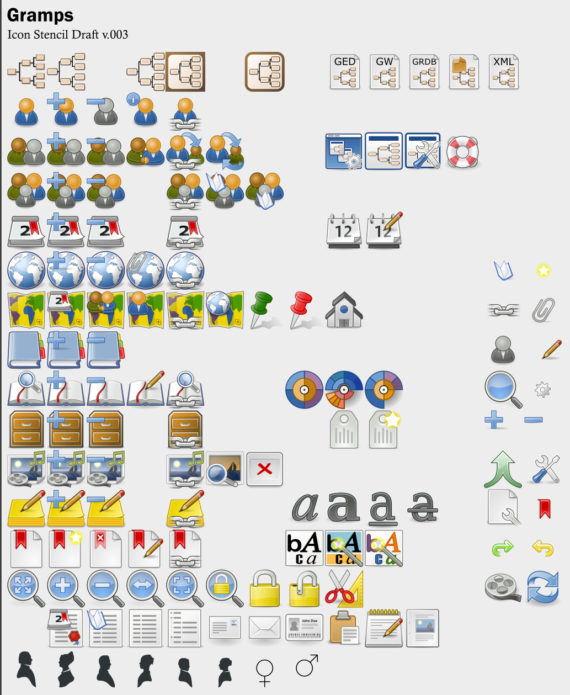

   

# GTheme
Working files default and custom SVG icons for use in themes for [The Gramps Project](https://github.com/gramps-project/gramps) Geneology Software.

* https://gramps-project.org/wiki/index.php/Template:Icon/doc
* https://gramps-project.org/wiki/index.php/Gramps_icon_set

## Description

Working files, SVG Collection of default and new icons for use with Gramps Geneology Software, requested icons for Gramps Addons and concept icons for future themes.

* 16x16px
* 24x24px
* 48x48px
* SVG

* Primary Gramps object icons
* Derived relations and main views
* Secondary Gramps object icons
* Actions
* Geography types

### Dependencies

* Gramps
* Inkscape

## Help

Building an addon for Gramps?

Check out the Tango icon Guidelines:

http://tango.freedesktop.org/Tango_Icon_Theme_Guidelines

## Authors

Contributors:

-bjpcorp

## Version History

* 0.1
    * Unreleased
* 0.2
    * Unreleased
* 0.3
    * Unreleased
## Acknowledgments

Inspiration, code snippets, etc.
* [The Gramps Project](https://github.com/gramps-project/gramps)
* [Linked View Plugin](https://github.com/cdhorn/LinkedView)
* [GNOME](https://gitlab.gnome.org/GNOME/)
* [Tango icons](https://commons.wikimedia.org/wiki/Tango_icons)
* [adwaita-icon-theme](https://gitlab.gnome.org/GNOME/adwaita-icon-theme)
* [awesome-readme](https://github.com/matiassingers/awesome-readme)
